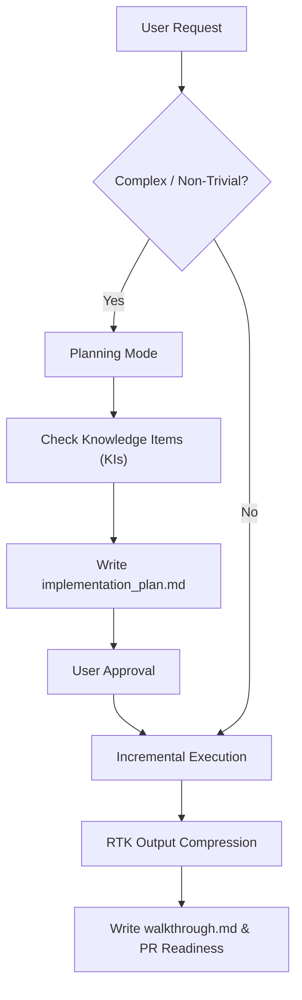

# Modern Antigravity Development Workflow

## Overview

Antigravity IDE pairs Gemini 3.6 models with agentic tool calling, Planning Mode, Knowledge Items, and output filtering via `rtk`.



## 1. Planning Mode & Artifacts

For non-trivial features, refactoring, or multi-step tasks:
1. The agent inspects `AGENTS.md`, project docs, and relevant KIs in `<appDataDir>/knowledge`.
2. The agent generates `<appDataDir>/brain/<conversation-id>/implementation_plan.md` with `request_feedback = true`.
3. The user reviews the plan and clicks **Proceed** / approves.
4. The agent executes phase by phase and records test output in `walkthrough.md`.

## 2. Interactive Slash Commands

Antigravity supports interactive slash commands:
- `/goal`: Run background goal processing until completion.
- `/grill-me`: Interactive interview to clarify underspecified requirements.
- `/learn`: Save workflow corrections as durable rules for future sessions.
- `/schedule`: Set one-shot timers or recurring cron triggers.

## 3. Output Compression with RTK

When running builds, tests, or large log searches, prefix commands with `rtk`:
```bash
rtk pytest
rtk cargo test
rtk npm test
```
This filters repetitive boilerplate output, preserving Gemini 3.6 context capacity for core code analysis.
