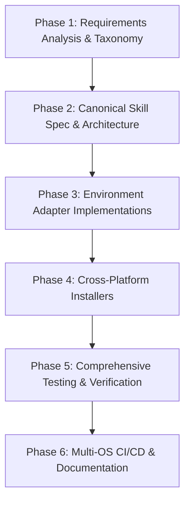

# Roadmap: Adapting the Agentic Workflow Across Multiple Coding Environments

## 1. Overview & Strategy

This roadmap details the end-to-end engineering workflow to adapt and extend the **Karpathy-inspired Universal AI Agent Framework** across multiple modern coding environments and operating systems.

The core working principles governing every phase:
- **Working code only**: Plausibility is not correctness. Verify every configuration and script before reporting done.
- **Never fabricate**: Commit hashes, file paths, APIs, terminal outputs, and test results must be strictly verified.
- **Say when a premise appears wrong**: Correct technical misconceptions immediately prior to implementation.
- **Touch only what the task requires**: Avoid drive-by refactoring, formatting sweeps, or gratuitous cleanup.
- **Direct, concise communication**: Zero fluff, filler, ceremonial openings, or emoji.

---

## 2. Phase Breakdown & Execution Workflow

---

### Phase 1: Requirements Analysis & Environment Taxonomy Mapping
**Objective**: Analyze discovery roots, prompt architectures, tool capabilities, and file system conventions for all target environments.

- [x] **1.1 Existing Target Audit**:
  - Audit current Antigravity IDE layout (`Antigravity IDE/`, `.agents/skills/`, `antigravity-home/`).
  - Audit current VS Code / GitHub Copilot layout (`Github Copilot/`, `.github/copilot-instructions.md`, `.github/prompts/`).
  - Review RTK context compression rules across existing targets.
- [ ] **1.2 Zed Editor Specification Analysis**:
  - Map Zed AI Assistant discovery paths: workspace `.zed/settings.json`, custom prompt directory `.zed/prompts/`, and global `~/.config/zed/`.
  - Analyze Zed slash command integration (`/file`, `/tab`, custom prompt slash commands).
  - Map Model Context Protocol (MCP) Context Servers support in Zed.
- [ ] **1.3 VSCodium & Open-Source Agent Analysis**:
  - Map Cline discovery: `.clinerules` in workspace root.
  - Map Roo-Code discovery: `.roomodes` custom mode definitions and instructions.
  - Map Continue.dev discovery: `.continue/config.json` systemMessage and `.continue/prompts/`.
- [ ] **1.4 Terminal & Headless Agent Analysis**:
  - Map Claude Code CLI: Workspace `CLAUDE.md` memory/instruction file.
  - Map Aider CLI: Workspace `.aider.conf.yml` and `.aider.prompt.md` convention files.
  - Map Neovim (Avante.nvim / CodeCompanion.nvim): System prompts and custom template directories.
- [ ] **1.5 Cross-OS Path & Tooling Audit**:
  - Document path differences for Linux (`~/.config`), macOS Darwin (`~/Library/Application Support/` vs `~/.config/`, Homebrew `/opt/homebrew`), and Windows (`$env:USERPROFILE\.config`, `$env:APPDATA`).
- **Exit Criteria**: Environment discovery matrix approved, specifying exact configuration paths, prompt formats, and injection hooks for all 5 target environment classes.

---

### Phase 2: Canonical Skill Specification & Architecture Design
**Objective**: Define a single source of truth for the 13 core skills and global operating rules to eliminate dual-maintenance drift.

- [ ] **2.1 Canonical Skill Schema**:
  - Design JSON/YAML validation schema (`specs/schema/skill.schema.json`) requiring `name`, `description`, `version`, `author`, `workflow`, and `triggers`.
  - Formalize the 13 production skills into canonical master definitions under `skills/<name>/SKILL.md`.
- [ ] **2.2 Canonical Operating Principles**:
  - Extract universal operating instructions (working code, anti-fabrication, surgical edits, RTK usage) into a master instruction template.
- [ ] **2.3 Adapter Engine Architecture**:
  - Design the projection/transpilation mechanism to compile canonical skills into:
    - Antigravity: `.agents/skills/<name>/SKILL.md`
    - GitHub Copilot: `.github/prompts/<name>.prompt.md`
    - Zed Editor: `.zed/prompts/<name>.md`
    - Roo-Code: `.roomodes` YAML/JSON definition
    - Continue: `.continue/prompts/<name>.prompt`
- **Exit Criteria**: Canonical skill schema passes validation; generator produces identical Antigravity and Copilot files to existing tracked baselines.

---

### Phase 3: Environment Adapter Implementations
**Objective**: Implement native configurations, instruction files, and prompt sets for each target environment.

- [x] **3.1 Antigravity IDE (Baseline)**:
  - Global configuration: `antigravity-home/` (`AGENTS.md`, `skills.json`, `rules/default.rules`).
  - Workspace configuration: `.agents/skills/` (13 skills), `.agents/rules/coding-agent.md`.
  - Planning Mode and Knowledge Item integration validated.
- [x] **3.2 VS Code + GitHub Copilot (Baseline)**:
  - Master instructions: `Github Copilot/.github/copilot-instructions.md`.
  - Modular partials: `Github Copilot/.github/instructions/`.
  - 13 prompt files: `Github Copilot/.github/prompts/*.prompt.md`.
- [ ] **3.3 Zed Editor Adaptation**:
  - Create `Zed/.zed/settings.json` specifying assistant system prompt with core principles and RTK execution rules.
  - Create 13 Zed custom prompt files under `Zed/.zed/prompts/<name>.md`.
  - Configure Model Context Protocol (MCP) server integration if required for local filesystem tools.
- [ ] **3.4 VSCodium (Cline / Roo-Code / Continue) Adaptation**:
  - Create `VSCodium/.clinerules` containing the master operating principles.
  - Create `VSCodium/.roomodes` defining custom agent personas matching core skills (`ai-project-manager`, `axiom`, `pr-readiness`, etc.).
  - Create `VSCodium/.continue/config.json` with systemMessage and prompt templates.
- [ ] **3.5 Terminal / CLI / Neovim Adaptation**:
  - Create `Terminal/CLAUDE.md` with concise operating rules, RTK command instructions, and skill references for Claude Code.
  - Create `Terminal/.aider.conf.yml` and instruction files for Aider.
  - Create Avante.nvim template configurations.
- **Exit Criteria**: All target directories contain fully realized, valid native configurations representing all 13 core skills and master operating principles.

---

### Phase 4: Cross-Platform Installers & Deployment Engine
**Objective**: Implement safe, idempotent, non-destructive installer scripts supporting Linux, macOS, and Windows.

- [ ] **4.1 Unified Linux & macOS Installer (`scripts/install.sh`)**:
  - Support multi-target selection: `--target [antigravity|copilot|zed|vscodium|terminal|all]`.
  - Support dry-run mode (`--dry-run`) with detailed visual diff of actions.
  - Implement OS detection (Linux vs. macOS Darwin) and map correct user configuration directories (`~/.config` vs `~/Library/Application Support`).
  - Automatic timestamped backup creation under target-specific backup directories.
  - Symlink deployment by default with copy fallback.
- [ ] **4.2 Unified Windows PowerShell Installer (`scripts/install.ps1`)**:
  - Support identical CLI flags (`-Target`, `-DryRun`, `-Backup`).
  - Map Windows paths (`$env:APPDATA`, `$env:USERPROFILE\.config`, `$env:USERPROFILE\.gemini`).
  - Implement non-destructive backups and idempotent link/copy creation.
- [ ] **4.3 Uninstaller & Restore Tooling**:
  - Implement `--rollback` / `scripts/uninstall.sh` to cleanly restore backed-up configurations.
- **Exit Criteria**: Installers execute cleanly in both dry-run and live modes on Linux, macOS, and Windows without modifying unmanaged runtime state.

---

### Phase 5: Comprehensive Verification & Automated Testing Suite
**Objective**: Build rigorous validation gates to prevent regression, broken syntax, or skill parity drift.

- [ ] **5.1 Static Analysis & Linting**:
  - Validate all shell scripts with `bash -n` and `shellcheck`.
  - Validate all PowerShell scripts with `pwsh -Command "[ScriptBlock]::Create(...)"`.
  - Validate YAML frontmatter in all skill and prompt files across all target directories.
- [ ] **5.2 Automated Skill Parity Test**:
  - Implement automated parity assertion script (`scripts/test-skill-parity.sh`) ensuring exactly 13 skills exist across all target directories with identical names and descriptions.
- [ ] **5.3 Sandboxed Installation Integration Tests**:
  - Extend `test-install.sh` and `test-install.ps1` to test installation of each target (`antigravity`, `copilot`, `zed`, `vscodium`, `terminal`, `all`) in an isolated temporary directory (`mktemp -d`).
  - Assert that dry-run creates 0 files.
  - Assert that live install creates correct symlinks and files.
  - Assert idempotency: re-running installation produces 0 errors and no redundant nested directories.
- [ ] **5.4 Agent Dry-Run Verification**:
  - Perform live dry-run checks with each agent environment verifying that prompt triggers load the correct skill instructions and that commands properly invoke `rtk`.
- **Exit Criteria**: `validate-all.sh` runs all static checks, parity checks, and sandboxed installer tests, exiting 0.

---

### Phase 6: Multi-OS CI/CD Pipeline & Documentation
**Objective**: Automate validation in GitHub Actions and provide end-user documentation.

- [ ] **6.1 Expand CI Matrix (`.github/workflows/validate.yml`)**:
  - Job 1: `validate-linux` on `ubuntu-latest` (runs `shellcheck`, `validate-all.sh`).
  - Job 2: `validate-macos` on `macos-latest` (runs `validate-all.sh` with Darwin path checks).
  - Job 3: `validate-windows` on `windows-latest` (runs PowerShell validation and test-install).
- [ ] **6.2 Comprehensive Documentation**:
  - Update top-level `README.md` with instructions for all supported environments.
  - Create dedicated layout and workflow guides:
    - `docs/ZED_LAYOUT.md`
    - `docs/VSCODIUM_LAYOUT.md`
    - `docs/TERMINAL_LAYOUT.md`
  - Maintain unified `TASKS.md` with active phase status.
- **Exit Criteria**: GitHub Actions CI passes across Linux, macOS, and Windows; documentation is fully aligned with directory structure.

---

## 3. Risk Assessment & Mitigations

| Risk | Impact | Mitigation Strategy |
| :--- | :--- | :--- |
| **Skill Divergence / Content Drift** | High | Establish canonical skill definitions in Phase 2; enforce 100% automated parity checking in CI. |
| **macOS vs. Linux Path Inconsistencies** | Medium | Explicitly test Darwin path variables in CI on `macos-latest`; use standard XDG paths where supported. |
| **Windows Symlink Permission Restrictions** | Medium | Check Developer Mode / SeCreateSymbolicLinkPrivilege in `install.ps1`; fallback to hard link or file copy if symlinks are denied. |
| **RTK Binary Missing on Target System** | Low | Document cargo installation; enforce graceful agent fallback to raw commands when `rtk` is not detected in `$PATH`. |
| **Accidental Overwrite of User Config** | High | Mandatory timestamped backup before touching existing files; support `--dry-run` to preview all mutations. |
